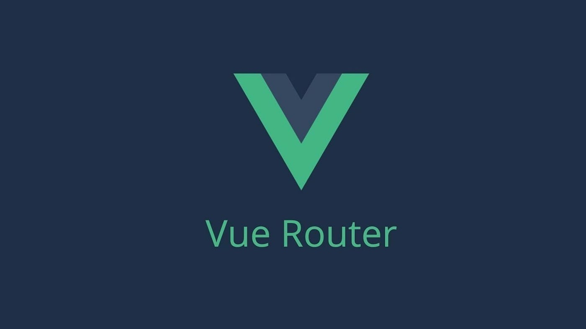
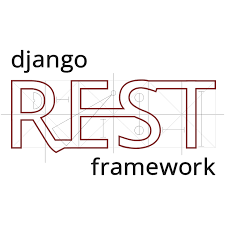
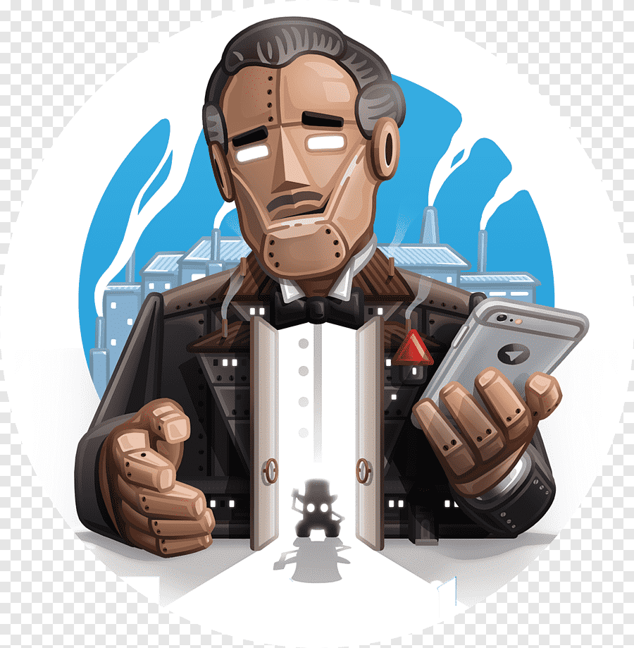

     

#Hi... I'm Oleh  

A passionate **Full Stack Developer** from Ukraine, dedicated to crafting **innovative**, **responsive**, and **user-friendly** digital products. I thrive on transforming complex challenges into seamless and enjoyable web experiences, ensuring **inclusivity** and **accessibility** for all users.
- Open to project collaborations
- You can reach me through:   

##  **Languages and Tools:**

### Front-end

### Back-end
   

### Databases

### Web Scraping 
 

### DevOps / Tools
  

##  Github Stats 

 
 
 

     

